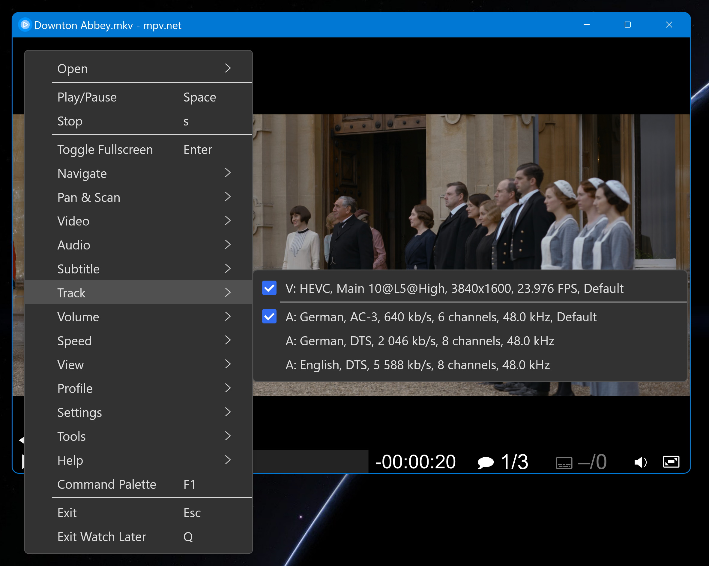
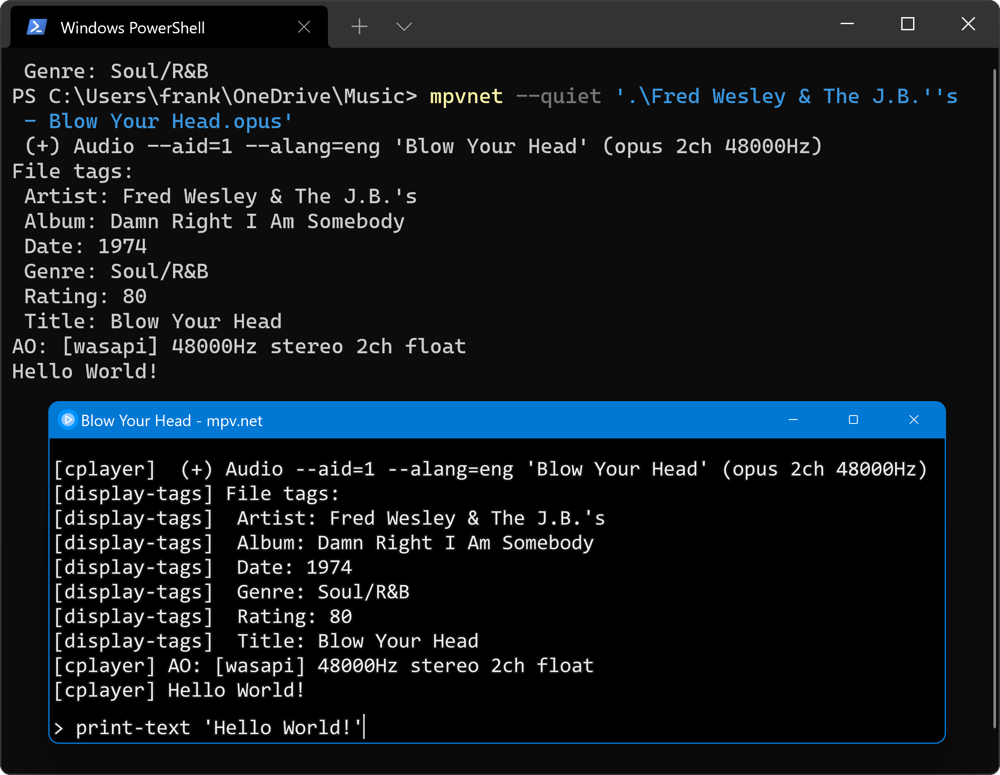
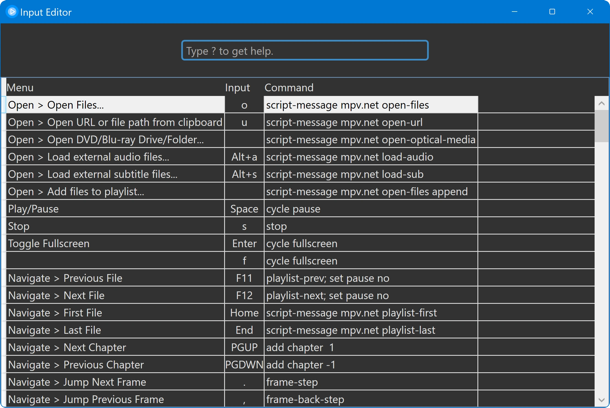
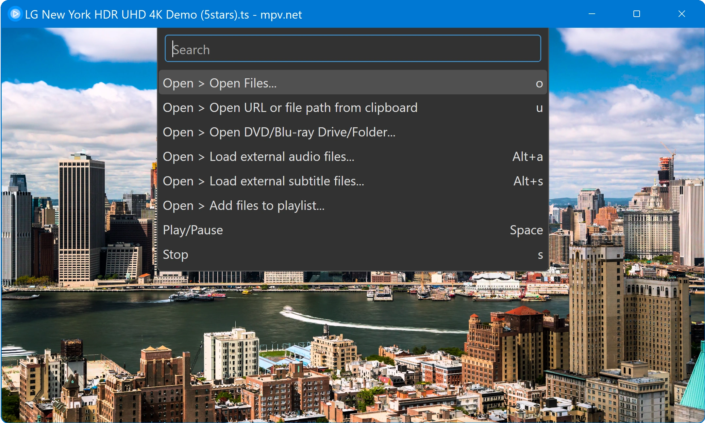
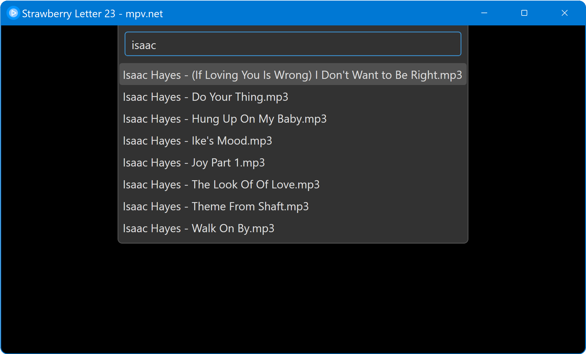

    

🎞 mpv.net
==========

mpv.net is a modern media player for Windows based on the popular [mpv](https://mpv.io) player.

#### Graphical User Interface

Modern GUI with customizable color themes.

#### Command Line Interface

mpv.net supports mpv's property based command line switches.

#### High quality video output

Video output that is capable of many features loved by videophiles,
such as video scaling with popular high quality algorithms,
color management, frame timing, interpolation, HDR, and more.

#### On Screen Controller

Play controls with a modern flat design.

#### GPU video decoding

Leverages the FFmpeg hwaccel APIs to support DXVA2 video decoding acceleration.

#### Active development

mpv.net is under active development.

#### Based on libmpv

mpv.net is based on libmpv which offers a straightforward C API that
was designed from the ground up to make mpv usable as a library and
facilitate easy integration into other applications.
mpv is like VLC not based on DirectShow or Media Foundation. 

Table of contents
-----------------

- [Features](#features-that-mpv-and-mpvnet-have-in-common)
- [Support](#support)
- [Download](#download)
- [Manual](#manual)
- [Screenshots](#screenshots)

Features that mpv and mpv.net have in common
--------------------------------------------

- Lua and JavaScript Scripting
- Simple config files that are easy to read and edit
- JSON IPC to control the player with a external programs
- On Screen Controler (OSC, play control buttons) with modern flat design
- Command Line Interface
- Started from a terminal status, error and debug output is printed on the terminal
- DXVA2 video decoding acceleration
- Video output capable of features loved by videophiles, such as video scaling with popular high quality algorithms, color management, frame timing, interpolation, HDR, and more
- Browser extensions to start mpv(.net) from the browser
- Fast seek performance
- Fast startup performance
- Usable as video player, audio player and image viewer with a wide range of supported formats
- Built-in decoders, no external codecs have to be installed
- Build-in media streaming (requires youtube-dl being installed)
- External audio and subtitle files can be loaded manually or automatically
- Screenshot feature
- Watch later feature to save the video position

Features exclusiv to mpv.net
----------------------------

- High degree of mpv compatibility, almost all mpv features are available
- Modern graphical user interface with customizable color themes
- Customizable context menu defined in the same file as the key bindings
- Searchable config editor
- Searchable input (shorcut keys) editor
- C# and PowerShell Scripting
- Global keyboard shortcuts
- Command palette to quickly and easily find commands and keys
- Extension API for .NET languages (C#, VB.NET and F#)
- Setup as x64 installer, portable, Chocolatey and WinGet
- Setup dialog for system integration (file associations etc.)
- File history feature to log time and filename
- Files can be enqueued from File Explorer
- Update check and update routine

## [Support](docs/Manual.md#support)

[Support section of the manual.](docs/Manual.md#support)

## [Download](docs/Manual.md#download)

[Download section of the manual.](docs/Manual.md#download)

## [Manual](docs/Manual.md)

[The mpv.net documentation.](docs/Manual.md)

Screenshots
-----------

#### Main Window

#### Context Menu

Context menu using dark mode.

#### Config Editor

Searchable config editor as alternative to edit the conf file manually.

#### Terminal

OSD console and status printed on the terminal.

#### Input Editor

Searchable key and mouse binding editor.

#### Command Palette

Command Palette to easily find commands and shortcut keys.

#### Playlist

The command palette based playlist showing my favorite artist of the stax record label.

Related apps
------------

Find a list of related apps:

https://stax76.github.io/frankskare
