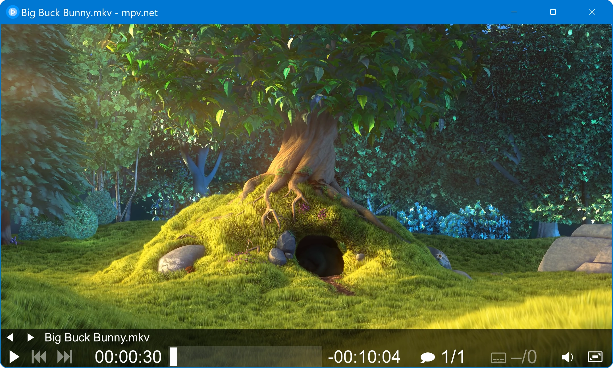
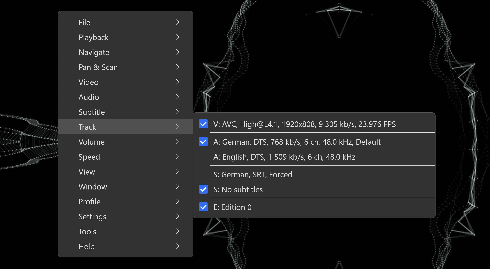
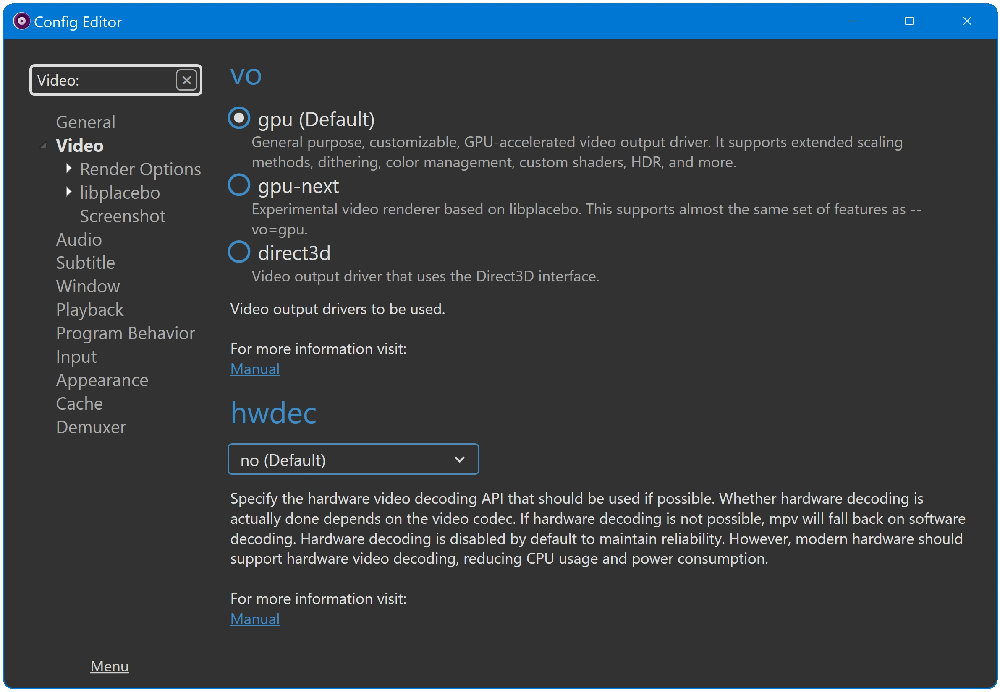
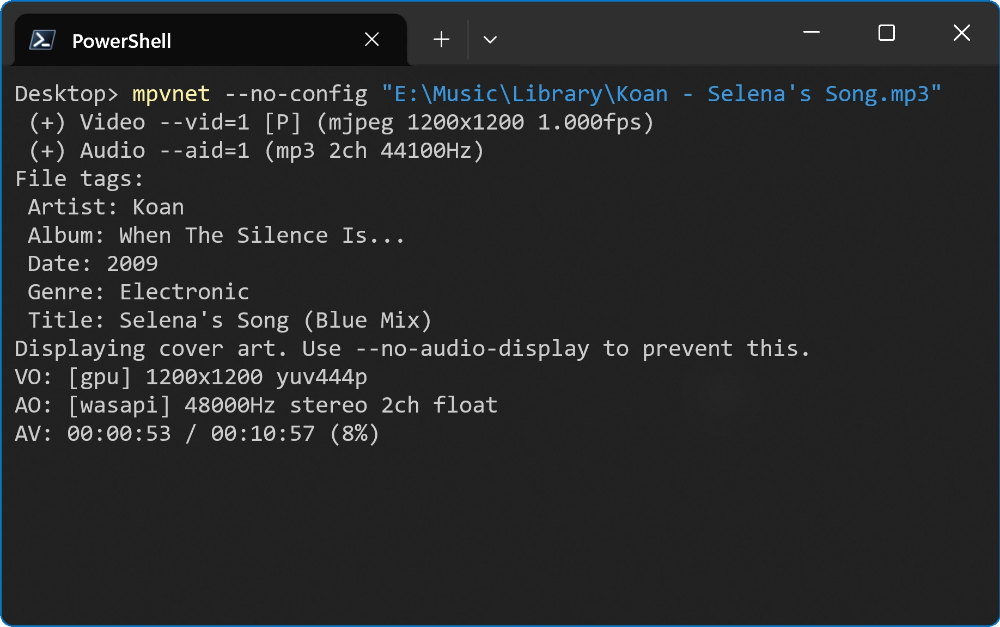

    

🎞 mpv.net
==========

mpv.net is a media player for Windows with a modern GUI.

The player is based on the popular [mpv](https://mpv.io) media player.
mpv.net is designed to be mpv compatible, almost all mpv features are available,
this means the official [mpv manual](https://mpv.io/manual/master/) applies to mpv.net,
differences are documented in the [mpv.net manual](docs/manual.md#differences-compared-to-mpv).

#### Graphical User Interface

Modern GUI with customizable color themes.

#### Command Line Interface

mpv.net supports mpvs command line interface.

#### High quality video output

Video output that is capable of many features loved by videophiles,
such as video scaling with popular high quality algorithms,
color management, frame timing, interpolation, HDR, and more.

#### On Screen Controller

Play controls with a modern flat design.

#### GPU video decoding

Leverages the FFmpeg hwaccel APIs to support DXVA2 video decoding acceleration.

#### Based on libmpv

mpv.net is based on libmpv which offers a straightforward C API that
was designed from the ground up to make mpv usable as a library and
facilitate easy integration into other applications.
mpv is like VLC not based on DirectShow or Media Foundation. 

Table of contents
-----------------

- [Features](#features-that-mpv-and-mpvnet-have-in-common)
- [Support](#support)
- [Download](#download)
- [Manual](#manual)
- [Screenshots](#screenshots)

Features that mpv and mpv.net have in common
--------------------------------------------

- Lua and JavaScript Scripting ([awesome-mpv lists a large collection of available user scripts](https://github.com/stax76/awesome-mpv))
- Simple config files that are easy to read and edit
- JSON IPC to control the player with a external programs
- On Screen Controller (OSC, play control buttons) with modern flat design
- Command Line Interface
- Started from a terminal, status, error and debug output is printed on the terminal
- DXVA2 video decoding acceleration
- Video output capable of features loved by videophiles, such as video scaling with popular high quality algorithms, color management, frame timing, interpolation, HDR, and more
- Browser extensions to start mpv.net from the browser
- Fast seek performance
- Fast startup performance
- Usable as video player, audio player and image viewer with a wide range of supported formats
- Built-in decoders, no external codecs have to be installed
- Build-in media streaming (requires yt-dlp being installed)
- External audio and subtitle files can be loaded manually or automatically
- Screenshot feature
- Internationalization using gettext and transifex

Features exclusive to mpv.net
----------------------------

- Very high degree of mpv compatibility, almost all mpv features are available
- Modern graphical user interface with customizable color themes
- Customizable context menu
- Searchable config editor
- Searchable input (shorcut keys) editor
- Global keyboard shortcuts
- Extension API for .NET languages (C#, VB.NET and F#)
- Files can be enqueued from File Explorer

## [Support](docs/manual.md#support)

[Support section of the manual.](docs/manual.md#support)

## [Download](docs/manual.md#download)

[Download section of the manual.](docs/manual.md#download)

## [Manual](docs/manual.md)

[The mpv.net documentation.](docs/manual.md)

Screenshots
-----------

#### Main Window

#### Context Menu

#### Config Editor

Searchable config editor as alternative to edit the conf file manually.

#### Terminal

